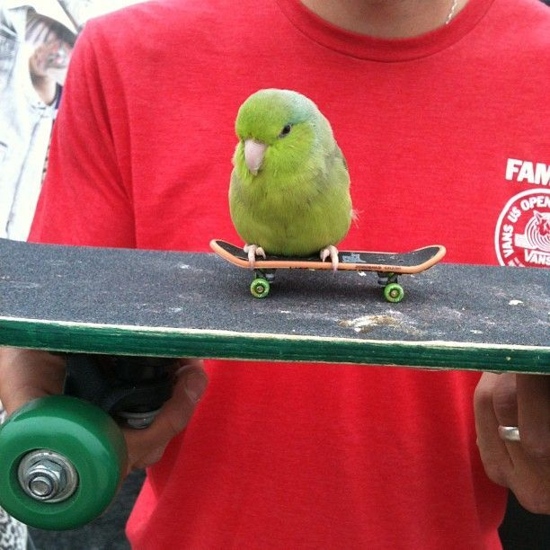
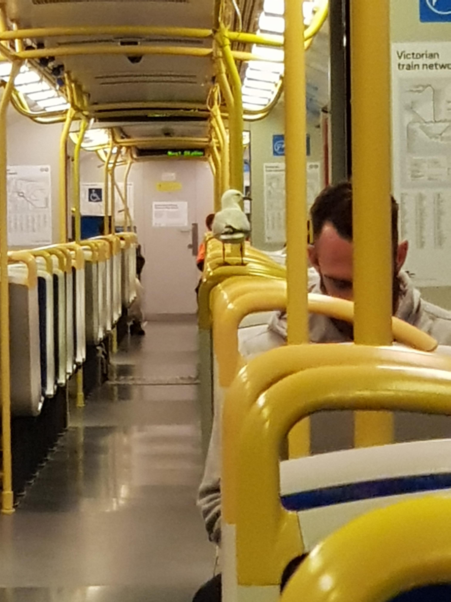
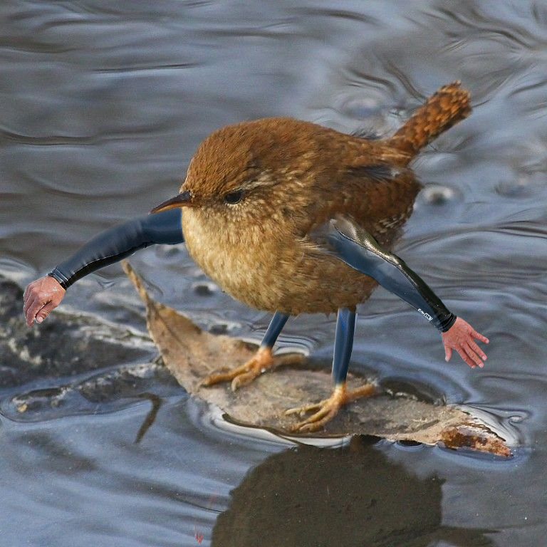

<style>
/*section.lead h1 {
     font-size: 60px;
}*/
</style>

<!-- _class: lead -->

# Presentation Title:

## Subtitle (or a line like ----)

### 28 - 03 - 2023 | Group meeting

<!--  -->

---

# Blockquote example

> This is stuff in a quote, and is supposed to be highlighted.
> Things her should be:
>
> * Highlighted
> * Easy to read!
> * Anything else?

---

# Header, but it's not super important

* Monta Rosa is a mountain
* It is close to the Mont Blanc
* There is a hiking tour around the mountain: the "Tour de Monta Rosa"
* Blahblah
* Random maths time: $a^2 + b^2 = c^2$

---

# Another slide, with half an image



* Look at the cute bird!
* It is so cute!
* It is riding a skateboard on top of another scateboard!
* There is also some math: $a = 3x^2 + 4$

---

# Another slide, with 2 images




* Now there are two cool birds
* Look at their cuteness
* It is all-overpowering, omg!
* The second one is on the train!

---

# Centered image

1. This is a centered image
2. It is a little bird on a surfboard!
3. Look at her go
4. She has arms - WEIRRRD.



---

# Also show quotes and code

> This is stuff in a quote, and is supposed to be highlighted.
> Things her should be:
>
> * Highlighted
> * Easy to read!
> * Anything else?

\
Below I show some code:

``` python
"""This is a block of code"""
import numpy as np
import matplotlib.pyplot as plt
x = np.linspace(0,1,100)
y = x**2 + 3*x
plt.plot(x,y)
```
